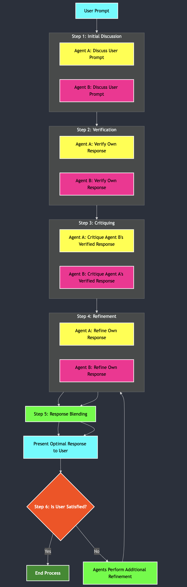

# Demo Multi-Agent Reasoning

## MỤC LỤC

1. [Tổng Quan](#1-tổng-quan)
2. [Nguyên Lý Hoạt Động](#2-nguyên-lý-hoạt-động)
3. [Các Bước Thực Hiện](#3-các-bước-thực-hiện)
4. [Thư Viện Và Dịch Vụ](#4-thư-viện-và-dịch-vụ)
5. [Cấu Trúc Thư Mục](#5-cấu-trúc-thư-mục)
6. [Hướng Dẫn Chạy](#6-hướng-dẫn-chạy)
7. [Cách Sử Dụng Giao Diện](#7-cách-sử-dụng-giao-diện)
8. [Xem Metrics Và Lịch Sử](#8-xem-metrics-và-lịch-sử)
9. [Tùy Chỉnh Nâng Cao](#9-tùy-chỉnh-nâng-cao)
10. [Ví Dụ Sử Dụng](#10-ví-dụ-sử-dụng)
11. [Câu Hỏi Thường Gặp](#11-câu-hỏi-thường-gặp)

---

## 1. TỔNG QUAN

Multi-Agent Reasoning là một ứng dụng web Streamlit giúp bạn tìm được câu trả lời tối ưu thông qua việc hợp tác của nhiều AI agents. Thay vì chỉ một agent trả lời, hệ thống này sử dụng 2 agents hoạt động song song với những quan điểm khác nhau, sau đó kết hợp lại để cho ra câu trả lời chất lượng cao nhất.

---

## 2. NGUYÊN LÝ HOẠT ĐỘNG

Hệ thống hoạt động theo 5 bước lập luận (reasoning steps):

### 2.1 Quy Trình Hoạt Động

BƯỚC 1: THẢO LUẬN
- Agent 1 và Agent 2 cùng trả lời câu hỏi từ góc độ riêng
- Mỗi agent đưa ra ý kiến ban đầu (opinions)
- Lưu các ý kiến này để sử dụng ở bước tiếp theo

BƯỚC 2: XÁC MINH (Verify Phase)
- Mỗi agent tự kiểm tra lại câu trả lời của mình
- Xác minh độ chính xác và tính hợp lý
- Sửa lại nếu cần thiết (verified_opinions)
- Đảm bảo thông tin không có sai sót

BƯỚC 3: PHẢN BIỆN (Critique Phase)
- Agents nhận xét lẫn nhau về câu trả lời
- Đưa ra các điểm yếu, thiếu sót
- Suy nghĩ phản biện (critiques)
- Giúp cải thiện chất lượng

BƯỚC 4: TINH CHỈNH (Refine Phase)
- Dựa trên phản biện, mỗi agent sửa lại câu trả lời
- Bổ sung thông tin thiếu
- Cải thiện cách trình bày (refined_opinions)
- Làm cho câu trả lời tốt hơn

BƯỚC 5: KẾT HỢP (Blend Phase)
- Kết hợp tất cả ý kiến đã tinh chỉnh
- Tạo một câu trả lời duy nhất (optimal_response)
- Loại bỏ những phần trùng lặp
- Sắp xếp lại theo logic hợp lý
- KẾT QUẢ CUỐI CÙNG - Câu trả lời tối ưu

### 2.2 Sơ Đồ Quy Trình



### 2.3 Chi Tiết Từng Bước

| Bước | Tên | Mục Đích | Kết Quả |
|------|-----|---------|--------|
| 1 | Discuss | Agents đưa ra ý kiến ban đầu | Ý kiến từ 2 agents |
| 2 | Verify | Kiểm tra lại tính chính xác | Ý kiến đã xác minh |
| 3 | Critique | Phản biện lẫn nhau | Những nhận xét cải tiến |
| 4 | Refine | Sửa lại dựa trên phản biện | Ý kiến đã tinh chỉnh |
| 5 | Blend | Kết hợp thành câu trả lời cuối | Câu trả lời tối ưu |

---

## 3. CÁC BƯỚC THỰC HIỆN

Quy trình hoạt động có thể được mô tả như sau:

Bước 1: Nhập câu hỏi
Bước 2: Hệ thống chạy 5 bước lập luận
- Thảo luận
- Xác minh
- Phản biện
- Tinh chỉnh
- Kết hợp
Bước 3: Hiển thị kết quả
Bước 4: Nếu hài lòng - lưu lịch sử
        Nếu không hài lòng - yêu cầu tinh chỉnh lại
Bước 5: Tiến hành tinh chỉnh hoặc lưu và hoàn tất

---

## 4. THƯ VIỆN VÀ DỊCH VỤ

### 4.1 Công Nghệ Chính

| Công Nghệ | Phiên Bản | Mục Đích |
|-----------|-----------|---------|
| Python | 3.10+ | Ngôn ngữ lập trình chính |
| Streamlit | Latest | Framework xây dựng giao diện web |
| OpenAI API | gpt-4o | AI Models cho agents |
| Pandas | Latest | Xử lý dữ liệu bảng biểu |
| Matplotlib | Latest | Tạo biểu đồ metrics |
| Python-dotenv | Latest | Quản lý biến môi trường |
| Colorama | Latest | Hiển thị màu sắc trong console |
| Tiktoken | Latest | Đếm tokens chi phí API |

### 4.2 Dịch Vụ Ngoài

- OpenAI API - Cung cấp models gpt-4o cho agents
- GitHub - Lưu trữ code repository

### 4.3 Tệp requirements.txt

```
openai>=1.0.0
colorama
tiktoken
matplotlib
python-dotenv
streamlit
pandas
```

---

## 5. CẤU TRÚC THƯ MỤC

```
multi-agent-reasoning/
|
+-- app.py
|   Ứng dụng Streamlit chính
|   Chứa toàn bộ giao diện và logic thương mại
|
+-- config/
|   Cấu hình hệ thống
|   - config.py: Cấu hình chính (tokens, models, etc)
|   - agent_config.py: Cấu hình từng agent
|   - logging_config.py: Cấu hình logging
|   - openai_client.py: Client OpenAI
|   - __init__.py
|
+-- core/
|   Logic lõi của hệ thống
|   - agent.py: Lớp Agent chính
|     * discuss(): Thảo luận (bước 1)
|     * verify(): Xác minh (bước 2)
|     * critique(): Phản biện (bước 3)
|     * refine(): Tinh chỉnh (bước 4)
|   - agent_init.py: Khởi tạo agents từ agents.json
|   - blend.py: Kết hợp câu trả lời từ nhiều agents (bước 5)
|   - reasoning.py: Logic lập luận chính
|   - session.py: Quản lý session và lưu lịch sử
|   - __init__.py
|
+-- utils/
|   Các hàm tiện ích
|   - utils.py: Hàm phỏ trợ chung
|   - console.py: In thông báo có màu sắc trong terminal
|   - __init__.py
|
+-- visualization/
|   Hiển thị dữ liệu
|   - metrics.py: Tính toán và vẽ metrics
|   - __init__.py
|
+-- img/
|   Hình ảnh
|   - reasoningflow.png: Sơ đồ quy trình lập luận
|
+-- agents.json
|   Cấu hình chi tiết của 2 agents
|
+-- .env.example
|   Template cho .env
|
+-- reasoning_history.json
|   Lịch sử tất cả lần chạy - chạy app rồi mới có
|
+-- reasoning.log
|   Log file debug - chạy app rồi mới có
|
+-- requirements.txt
|   Danh sách thư viện cần cài
|
+-- README.md
```

### 5.1 Giải Thích Từng Folder Và File Chính

#### Folder config - Cấu Hình Hệ Thống

- config.py: Lưu trữ tất cả các tham số như max tokens, số lần retry, tên model
- agent_config.py: Cấu hình riêng cho từng agent (tên, kiểu, system message)
- openai_client.py: Khởi tạo OpenAI client để kết nối API
- logging_config.py: Cấu hình debug logging

#### Folder core - Logic Lõi

- agent.py: Lớp Agent với 4 phương thức chính:
  - discuss(): Thảo luận (bước 1)
  - verify(): Xác minh (bước 2)
  - critique(): Phản biện (bước 3)
  - refine(): Tinh chỉnh (bước 4)
- blend.py: Kết hợp các câu trả lời từ 2 agents (bước 5)
- reasoning.py: Điều phối toàn bộ quy trình 5 bước
- session.py: Lưu/tải lịch sử từ reasoning_history.json

#### Folder utils - Tiện Ích

- utils.py: Các hàm phỏ trợ (xử lý tokens, etc)
- console.py: In thông báo có màu sắc trong terminal

#### Folder visualization - Metrics Và Biểu Đồ

- metrics.py: Tính toán metrics (tốc độ, token usage) và vẽ biểu đồ

#### File app.py - Ứng Dụng Chính

File này là trái tim của ứng dụng, chứa:
- Giao diện Streamlit (3 tabs)
- Logic điều phối quy trình 5 bước
- Xử lý feedback và refinement loops
- Lưu lịch sử

---

## 6. HƯỚNG DẪN CHẠY

Bước 1: Clone Repository

```bash
# Open terminal
# Clone repository về máy
git clone https://github.com/bingbleene/demo-multi-agents-reasoning.git

# Vào thư mục dự án
cd multiagent_reasoning/real-demo
```

Bước 2: Thiết Lập API Key Và Model

2.1 - Tạo file .env

Tham khảo file .env.example:

```bash
# Sao chép template
cp .env.example .env
```

2.2 - Điền OpenAI API Key

Mở file .env trong editor (VS Code, Notepad++, etc) và điền:

```env
# OpenAI API Configuration
OPENAI_API_KEY=sk-svcacct-...api-key-của-bạn...
OPENAI_MODEL=gpt-4o

# Các cấu hình khác (tùy chỉnh)
MAX_TOTAL_TOKENS=4096
MAX_REFINEMENT_ATTEMPTS=3
RETRY_LIMIT=3
```

Cách lấy OpenAI API Key:
1. Đi tới https://platform.openai.com/api-keys
2. Đăng nhập tài khoản OpenAI
3. Tạo API key mới
4. Copy và dán vào .env

Tùy Chỉnh Model:
- Thay gpt-4o bằng các model khác nếu muốn
  (Ví dụ: gpt-4-turbo, gpt-3.5-turbo)

Bước 3: Cài Đặt Thư Viện

```bash
# Tạo virtual environment (Python)
python -m venv venv

# Kích hoạt virtual environment
# Trên Windows:
venv\Scripts\activate

# Trên Mac/Linux:
source venv/bin/activate

# Cài đặt các thư viện trong requirements.txt
pip install -r requirements.txt
```

Bước 4: Chạy Ứng Dụng

```bash
# Chỉ cần một lệnh
streamlit run app.py
```

Bạn sẽ thấy output:

```
  You can now view your Streamlit app in your browser.

  Local URL: http://localhost:8501
  Network URL: http://192.168.x.x:8501
```

Tự động mở trình duyệt hoặc vào: http://localhost:8501

---

## 7. CÁCH SỬ DỤNG GIAO DIỆN

### 7.1 Tab 1: Reasoning (Lập Luận)

Đây là tab chính nơi bạn chạy quy trình lập luận.

#### Bước 1: Nhập Câu Hỏi
- Tìm ô text "Hãy nhập câu hỏi hoặc vấn đề..."
- Gõ câu hỏi của bạn (ít nhất 5 ký tự)

Ví dụ:
```
1 cộng 1 bằng mấy?
```

#### Bước 2: Nhấn Nút Chạy Lập Luận
- Click button "Chạy Lập Luận"
- Hệ thống bắt đầu xử lý

#### Bước 3: Xem Kết Quả 5 Bước

Giao diện sẽ hiển thị 5 bước lập luận dưới dạng expandable (có thể click để mở):

BƯỚC 1: Thảo Luận Ban Đầu (click để mở)
```
Agent 1: [Ý kiến ban đầu của Agent 1]
Agent 2: [Ý kiến ban đầu của Agent 2]
```

BƯỚC 2: Xác Minh (click để mở)
```
Agent 1: [Ý kiến đã kiểm tra lại của Agent 1]
Agent 2: [Ý kiến đã kiểm tra lại của Agent 2]
```

BƯỚC 3: Phản Biện (click để mở)
```
Agent 1: [Nhận xét về câu trả lời của Agent 2]
Agent 2: [Nhận xét về câu trả lời của Agent 1]
```

BƯỚC 4: Tinh Chỉnh (click để mở)
```
Agent 1: [Ý kiến sửa lại của Agent 1]
Agent 2: [Ý kiến sửa lại của Agent 2]
```

BƯỚC 5: Kết Quả Cuối Cùng (hiển thị rõ ràng)
```
[Câu trả lời tối ưu được kết hợp từ cả 2 agents]
```

#### Bước 4: Feedback Và Tinh Chỉnh Lại (Tùy Chọn)

Sau khi xem kết quả, bạn có thể:

Nếu bạn muốn sửa lại câu trả lời:
1. Chọn "Không" trong phần "Kết quả này có hữu ích không?"
2. Nhập lý do tại sao không hài lòng
   (Ví dụ: "Thiếu chi tiết xử lý dữ liệu")
3. Click "Tinh Chỉnh Lại"
4. Hệ thống sẽ lập luận lại dựa trên feedback của bạn

Nếu bạn hài lòng:
1. Chọn "Có" hoặc "Trung Bình"
2. Click "Lưu Kết Quả"
3. Kết quả được lưu vào lịch sử

### 7.2 Tab 2: Metrics (Chỉ Số Hiệu Năng)

Hiển thị thông tin về hiệu suất của hệ thống:

- Thời gian xử lý cho từng bước
- Token usage (chi phí API)
- Biểu đồ hiệu năng

Thông tin này giúp bạn hiểu hệ thống chạy nhanh/chậm, tốn bao nhiêu token (tiền)

### 7.3 Tab 3: History (Lịch Sử)

Xem lại tất cả những lần bạn đã chạy trước đó.

Mỗi record lưu:
- Thời gian chạy
- Câu hỏi gốc
- Tất cả 5 bước lập luận
- Feedback của bạn
- Các lần tinh chỉnh lại

Các tính năng:
- Click các expander để xem chi tiết từng bước
- Tải xuống JSON để lưu trữ hoặc chia sẻ

---

## 8. XEM METRICS VÀ LỊCH SỬ

### 8.1 Metrics Tab - Hiểu Rõ Mỗi Chi Tiết

Khi bạn chạy 1 lần lập luận, metrics sẽ tính toán:

| Metric | Ý Nghĩa | Ví Dụ |
|--------|---------|-------|
| Elapsed Time | Thời gian chạy toàn bộ quy trình | 12.34 giây |
| Step Time | Thời gian từng bước | Bước 1: 2.1s |
| Total Tokens | Tổng token sử dụng (= tiền) | 2,450 tokens |
| Cost | Chi phí API (USD) | $0.074 |

Token là đơn vị tính chi phí của OpenAI.
1 token khoảng 4 ký tự tiếng Anh.
Giá = (input_tokens * input_rate) + (output_tokens * output_rate)

### 8.2 History Tab - Quản Lý Lịch Sử

Mỗi lần lưu kết quả, một record mới được thêm vào reasoning_history.json:

```json
{
  "timestamp": "2024-04-16 10:30:45",
  "user_prompt": "Giải thích machine learning",
  "step1_opinions": {...},
  "step2_verified": {...},
  "step3_critiques": {...},
  "step4_refined": {...},
  "step5_final": "Câu trả lời tối ưu",
  "refinement_loops": [
    {
      "loop_number": 1,
      "feedback_reason": "Cần thêm ví dụ",
      "refined_response": "..."
    }
  ],
  "user_feedback": "Yes",
  "feedback_reason": null
}
```

Cách xem lịch sử:
1. Vào Tab "History"
2. Hiển thị tất cả lần chạy trước (mới nhất ở trên)
3. Click vào bất kỳ record để mở expanders xem chi tiết
4. Có thể click "Tải JSON" để download toàn bộ lịch sử

---

## 9. TÙY CHỈNH NÂNG CAO

Nếu muốn sửa các prompt hoặc cấu hình nâng cao, hãy làm theo:

### 9.1 Tùy Chỉnh System Message Của Agents

Mở file config/agent_config.py và sửa system_message của từng agent:

```python
SYSTEM_MESSAGE = """
Bạn là một AI assistant chuyên về [lĩnh vực].
...
Hãy trả lời bằng tiếng Việt, rõ ràng và chi tiết.
"""
```

### 9.2 Tùy Chỉnh Prompt Cho Từng Bước

Mở file core/agent.py (hoặc core/blend.py) và sửa:

- Phương thức discuss() -> Prompt cho bước 1
- Phương thức verify() -> Prompt cho bước 2
- Phương thức critique() -> Prompt cho bước 3
- Phương thức refine() -> Prompt cho bước 4
- File core/blend.py -> Prompt cho bước 5

Ví dụ sửa bước 1:

```python
def discuss(self):
    prompt = f"""
    Hãy trả lời câu hỏi sau một cách chi tiết:
    "{self.current_prompt}"
    
    [Thêm hướng dẫn khác nếu muốn]
    """
    response = self.call_api(prompt)
    return response
```

### 9.3 Tùy Chỉnh Max Tokens Và Retry Logic

Sửa file .env:

```env
# Tăng max tokens nếu câu trả lời bị cắt ngắn
MAX_TOTAL_TOKENS=8192

# Tăng số lần retry nếu API thường bị lỗi
RETRY_LIMIT=5

# Tăng backoff nếu muốn chờ lâu hơn giữa các retry
RETRY_BACKOFF_FACTOR=3
```

### 9.4 Tùy Chỉnh Giao Diện (app.py)

Nếu muốn sửa đổi với CSS, màu sắc, layout:

- Tìm phần CSS trong app.py
- Sửa class .final-response, .step-container, etc
- Lưu file và tự động reload trên Streamlit

---

## 10. VÍ DỤ SỬ DỤNG

### 10.1 Kịch Bản Thực Tế

Bạn là một sinh viên học Tiếng Anh:

1. Nhập: "Hãy giải thích sự khác biệt giữa 'can' và 'could' trong tiếng Anh"

2. Hệ thống chạy 5 bước:
   - Bước 1: 2 agents thảo luận
   - Bước 2: 2 agents xác minh
   - Bước 3: 2 agents phản biện
   - Bước 4: 2 agents tinh chỉnh
   - Bước 5: Kết hợp thành câu trả lời

3. Kết quả:
   ```
   "Can" được dùng khi có khả năng hoặc được phép làm điều gì đó ở hiện tại.
   "Could" là quá khứ của "can", hoặc dùng để bày tỏ khả năng có điều kiện...
   ```

4. Feedback (tùy chọn):
   - Nếu thích: Click "Lưu Kết Quả"
   - Nếu muốn thêm ví dụ: Click "Không", nhập "Cần thêm ví dụ cụ thể"
   - Click "Tinh Chỉnh Lại" -> Hệ thống sửa lại với ví dụ

5. Xem Lịch Sử: Vào Tab "History" để xem toàn bộ cuộc hội thoại

---

## 11. CÂU HỎI THƯỜNG GẶP

Câu 1: Tại sao API key không hoạt động?

Đáp:
- Kiểm tra file .env, đảm bảo OPENAI_API_KEY đúng format
- API key phải bắt đầu với sk-svcacct- hoặc sk-proj-
- Kiểm tra đã điền đúng ký tự

Câu 2: Ứng dụng chạy rất chậm?

Đáp:
- Quy trình 5 bước cần gọi OpenAI API 8+ lần, thường mất 30-60 giây
- Có thể giảm MAX_TOTAL_TOKENS trong .env để nhanh hơn

Câu 3: Có cách nào tùy chỉnh prompt?

Đáp:
- Có! Xem phần "Tùy Chỉnh Nâng Cao" ở trên

Câu 4: Tôi có thể chạy offline không?

Đáp:
- Không, vì hệ thống dùng OpenAI API (cần internet)

Câu 5: Lưu trữ dữ liệu như thế nào?

Đáp:
- Tất cả trạng thái được lưu trong reasoning_history.json
- Có thể xuất ra file JSON để backup hoặc chia sẻ

Câu 6: Tôi có thể mở rộng hệ thống để có nhiều agents hơn không?

Đáp:
- Có! Sửa file agents.json để thêm nhiều agents hơn
- Sửa code core/reasoning.py để điều hành nhiều agents

Câu 7: Model cụ thể nào có chi phí thấp nhất?

Đáp:
- gpt-3.5-turbo có chi phí thấp nhất
- gpt-4o có chi phí cao hơn nhưng chất lượng tốt hơn
- Bạn có thể thay đổi trong .env

Câu 8: Tôi có thể tùy chỉnh chứa hướng dẫn của users không?

Đáp:
- Có! Sửa file app.py, tìm phần instructions hoặc help text
- Thêm/sửa text hướng dẫn theo yêu cầu của bạn

---

HỖ TRỢ VÀ ĐÓNG GÓP

Nếu bạn gặp vấn đề hoặc có gợi ý, vui lòng:
- Tạo Issues trên GitHub
- Gửi Pull Request nếu bạn có cải thiện
- Liên hệ qua nhóm 2 môn CS222.Q21

---

GIẤY PHÉP

Project này sử dụng MIT License - Tự do sử dụng cho mục đích cá nhân và thương mại.

---

Cảm ơn bạn đã sử dụng Multi-Agent Reasoning!

Tài liệu cập nhật lần cuối: April 16, 2026
